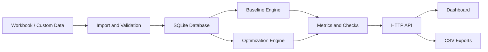

# CoolShift

CoolShift is a full-stack cooling optimization platform for the Rapid Forge Buildathon challenge. It imports the supplied public scenarios, validates 15-minute interval data, calculates the baseline schedule, generates optimized cooling recommendations, compares energy/cost/carbon/comfort metrics, and exports judge-ready CSV outputs.

## What It Includes

- Python backend using only the standard library at runtime
- SQLite database seeded from the supplied workbook
- Constraint-aware optimizer for AC/fan schedules, grid outages, solar, battery, comfort, cost, emissions, and explanations
- Responsive frontend dashboard with scenario/date controls, KPIs, charts, validation checks, interval table, and CSV exports
- Reproducible custom seven-day scenario generator
- Tests for acceptance conditions and validation cases

## Quick Start

```powershell
python scripts\import_workbook.py
python scripts\generate_outputs.py
python backend\app.py
```

Open:

```text
http://127.0.0.1:8000
```

If your system Python does not have `openpyxl`, run the importer with the bundled Python in Codex or install:

```powershell
pip install openpyxl
```

The running app itself does not require `openpyxl` once `data\coolshift.sqlite` exists.

## Judge Workflow

1. Select a scenario: `PUB-A`, `PUB-B`, `PUB-C`, or `TEAM-CUSTOM`.
2. Pick any available date and run 24-hour or seven-day optimization.
3. Review baseline vs optimized metrics, comfort status, battery/SOC chart, and reason-coded recommendations.
4. Change comfort, cost, emissions, or peak weights and rerun. Outputs update dynamically.
5. Export schedule and summary CSV files.

## Required Outputs

Generated files are written to `outputs/`:

- `public_results.csv`
- `summary_results.csv`

The default generation covers seven days for `PUB-A`, `PUB-B`, `PUB-C`, and `TEAM-CUSTOM`, producing at least 2,688 interval output rows.

## Architecture



## Method Summary

The optimizer is a deterministic, explainable heuristic:

- Prioritizes occupied comfort and vulnerable occupants.
- Reduces grid load during peak tariffs when comfort allows.
- Uses solar directly first, then charges the battery with excess clean energy.
- Discharges battery during outages, peak tariffs, and high comfort need while respecting reserve.
- Forces grid draw to zero during grid outages and reports unmet load or comfort infeasibility.
- Keeps AC/fan recommendations within installed appliance quantities and setpoint limits.

Detailed formulas and assumptions are in `docs/method.md`.

