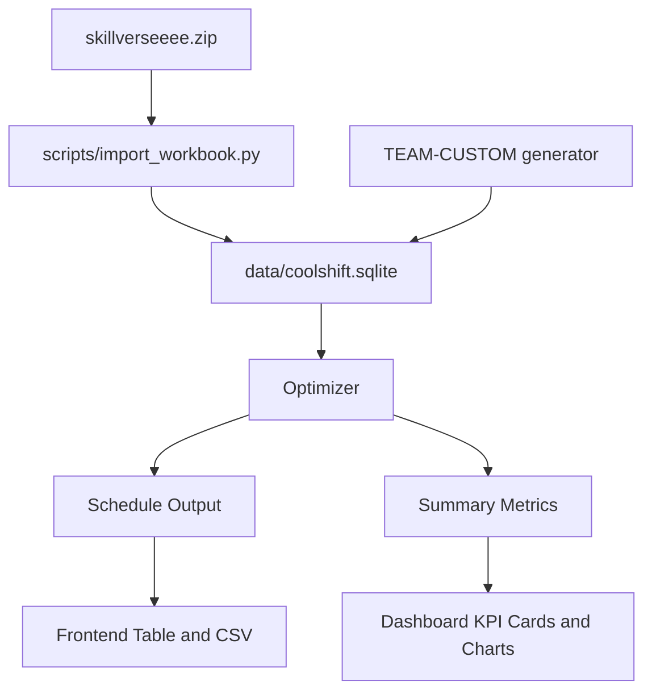

# Architecture

## Components

- `backend/app.py`: HTTP server, API routes, static file serving.
- `backend/coolshift/db.py`: SQLite schema and query helpers.
- `backend/coolshift/optimizer.py`: baseline, optimization, dispatch, summaries, validation checks.
- `backend/coolshift/importer.py`: workbook import logic.
- `backend/coolshift/sample_data.py`: reproducible custom scenario generation.
- `frontend/`: browser UI.
- `scripts/import_workbook.py`: creates `data/coolshift.sqlite` from the supplied ZIP workbook.
- `scripts/generate_outputs.py`: exports public and custom result CSVs.
- `tests/test_acceptance.py`: smoke and acceptance tests.

## Data Flow

